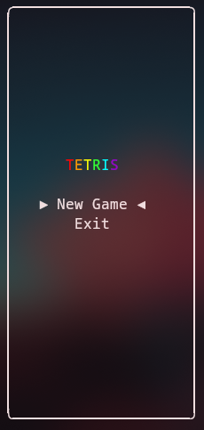
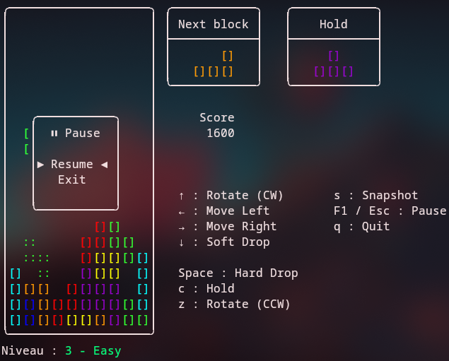

# Tetris


Une implémentation basique du jeu Tetris en C, jouable dans un terminal Linux.

## Informations

Ce projet a été initialement développé seul en 2025 afin de m'améliorer
en langage C.

Le code a ensuite été **entièrement refactorisé** pour repartir sur une base plus propre.
L'objectif est d'obtenir une architecture claire où la **logique du jeu est indépendante de l'interface**, afin de pouvoir brancher différentes interfaces facilement (terminal, graphique, etc.).

Actuellement seule une interface **ncurses** est incluse, mais le moteur du jeu est conçu pour pouvoir faire son propre affichage. Dans le futur, un affichage graphique sera ajouté avec **raylib**.

## Présentation

Le jeu fonctionne dans un terminal Linux.

Voici un aperçu de l'application.

<p align=center>
  
  
  
</p>

## Fonctionnalités

- moteur de jeu complet avec séparation claire logique / affichage
- implémentation des règles Tetris (déplacement, gravité, verrouillage)
- rotation des pièces avec système SRS (Super Rotation System)
- gestion du lock delay
- génération des pièces via 7-bag
- gestion du hold, preview et next piece
- détection des collisions et intégration des pièces dans la grille
- suppression des lignes, gestion du score et du niveau
- système de timing (tick, hard drop, soft drop)
- gestion des états du jeu (start, running, pause, game over)
- interface ncurses avec menus interactifs
- architecture modulaire permettant d’intégrer facilement d’autres rendus (raylib, SDL, etc.)

## Fonctionnement

### Architecture générale

Le projet est conçu avec une séparation stricte entre :
- le moteur du jeu (`core/`)
- l’interface utilisateur (`ui/`)

Le fichier `main.c` est volontairement générique :
- il initialise le jeu
- il exécute la boucle principale
- il appelle uniquement :
  - `input_handle()`
  - `game_update()`
  - `display_render()`

Cela permet de changer complètement l’affichage sans toucher au moteur.

### Interfaces (UI)

Une interface est définie par deux fonctions :

- `input_handle(Game *g)`
- `display_render(Game *g)`

Chaque UI possède son propre dossier :

```text
src/ui/
 ├── ncurses/
 ├── raylib/
```

Pour ajouter une nouvelle UI :
- créer un dossier (`ui/raylib/` par exemple)
- implémenter ces deux fonctions
- éventuellement ajouter dans le main l’initialisation et le cleanup spécifiques à l’interface

Aucune modification du moteur n’est nécessaire.

### Représentation du jeu

Le moteur repose sur deux éléments distincts :

#### Grille (`Grid`)
- contient uniquement les pièces déjà posées
- représente l’état figé du jeu

#### Tétrimino courant (`current`)
- n’est jamais stocké dans la grille
- possède une position relative à la grille

Le moteur ne fusionne pas directement la pièce dans la grille tant qu’elle est en mouvement.

### Rendu

L’affichage fonctionne en superposition :

1. affichage de la grille (historique)
2. affichage du tétrimino courant par-dessus

Cela évite de modifier la grille à chaque frame.

### Cycle de vie d’une pièce

1. génération via 7-bag
2. spawn dans la grille
3. déplacement / rotation (SRS)
4. détection des collisions
5. application du lock delay
6. insertion dans la grille
7. suppression des lignes
8. pièce suivante

## Architecture

```text
.
├── docs/                   # screens du projet
├── includes/
│   ├── core/               # headers du moteur de jeu
│   ├── ui/
│   │   ├── ncurses/        # headers de l’UI terminal
│   │   └── raylib/         # headers prévus pour une future UI graphique
│   ├── utils/              # headers des outils annexes
│   └── info.h              # informations sur le projet (version, date)
├── src/
│   ├── core/
│   │   ├── game.c          # boucle logique, états du jeu, spawn, reset
│   │   ├── game_settings.c # paramètres de gameplay
│   │   ├── grid.c          # grille, collisions, lock
│   │   ├── seven_bag.c     # génération des pièces
│   │   ├── tetrominos.c    # définitions des pièces et rotations
│   │   └── tick.c          # gestion du temps / vitesse
│   ├── ui/
│   │   ├── ncurses/
│   │   │   ├── colors.c    # gestion des couleurs terminal
│   │   │   ├── display.c   # rendu ncurses
│   │   │   └── input.c     # gestion des entrées ncurses
│   │   └── raylib/         # emplacement prévu pour une UI graphique
│   ├── utils/
│   │   ├── debug.c         # logs et debug
│   │   ├── snapshot.c      # sauvegarde / chargement d’état
│   │   └── tools.c         # fonctions utilitaires
│   └── main.c              # point d’entrée générique
├── Makefile
├── example_snapshot.txt
└── README.md
```

## Installation

Sous Linux :

```bash
git clone https://github.com/IAidenI/Tetris
cd Tetris
make
./tetris
# Ou
./tetris -d example_snapshot.txt
```

## A faire

### Architecture
- [X] Organiser proprement l’arborescence du projet (moteur, interface, utilitaires)
- [X] Restructure des dossiers/fichiers
- [X] Ajouter un parser d’arguments pour la ligne de commande

### Moteur du jeu
- [X] Implémenter la boucle de jeu (ticks)
- [X] Gestion de la gravité des pièces
- [X] Détection des collisions
- [X] Suppression des lignes complètes
- [X] Gestion du score
- [X] Système de niveaux et accélération du jeu
- [X] Système SRS pour la rotation des tetrominos
- [X] Problème avec le O qui rotate

### Gameplay
- [X] Gestion des inputs joueur
- [X] Ajout du hold
- [X] Ajout du ghost piece (aperçu de l’endroit où la pièce va tomber)
- [ ] Sauvegarde et affichage du meilleur score
- [X] Ajout de la fin du jeu
- [X] Ajout d'un lock delay
- [X] Ajout de la touche espace pour placer directement la pièce

### Interface utilisateur
- [X] Implémenter une première interface (terminal ncurses)
- [X] Ajouter un système de menus (start / pause / game over)
- [X] Améliorer l’affichage
- [X] Affichage des commandes
- [ ] Ajouter un affichage supplémentaire avec raylib

### Debug / outils
- [X] Implémenter un système de snapshot de la partie
- [X] Permettre de charger un état du jeu

### Refactor
- [X] Ajouter des commentaires et documenter le code
- [X] Mettre en static les fonctions qui en ont besoin
