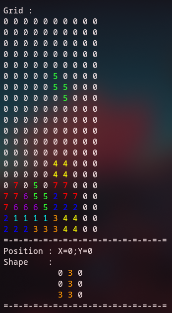

# Tetris


Une implémentation basique du jeu Tetris en C, jouable dans un terminal.

## Informations

Ce projet a été initialement développé seul en 2025 afin de m'améliorer
en langage C.

Le code a ensuite été **entièrement refactorisé** pour repartir sur une base plus propre.
L'objectif est d'obtenir une architecture claire où la **logique du jeu est indépendante de l'interface**, afin de pouvoir brancher différentes interfaces facilement (terminal, graphique, etc.).

Actuellement il n'y a pas de réel interface (juste un simple affichage dans le terminal), mais le moteur du jeu est conçu pour pouvoir être utilisé avec des  bibliothèques comme **ncurses** ou encore **raylib**.

## Présentation

Le jeu fonctionne dans un terminal Linux.

Voici un aperçu de l'application.

<p align=center>
  
</p>

## Fonctionnalités

-  moteur de jeu en cours de reconstruction avec une architecture propre
-  gestion des tetrominos (création, rotation et informations associées)
-  implémentation du 7-bag randomizer pour la génération des pièces
-  gestion de l’état du jeu (initialisation, spawn et placement des pièces)
-  base conçue pour pouvoir brancher facilement différentes UI (ncurses, raylib, etc.)

## Installation

Sous Linux :

```bash
git clone https://github.com/IAidenI/Tetris
cd Tetris
make
./Tetris
```

## A faire

Architecture
- [X] Organiser proprement l’arborescence du projet (moteur, interface, utilitaires)
- [X] Restructure des dossiers/fichiers
- [ ] Ajouter des commentaires et documenter le code
- [X] Ajouter un parser d’arguments pour la ligne de commande

Moteur du jeu
- [X] Implémenter la boucle de jeu (ticks)
- [X] Gestion de la gravité des pièces
- [X] Détection des collisions
- [X] Suppression des lignes complètes
- [X] Gestion du score
- [X] Système de niveaux et accélération du jeu
- [X] Système SRS pour la rotation des tetrominos
- [ ] Problème avec le O qui rotate

Gameplay
- [X] Gestion des inputs joueur
- [X] Ajout du hold
- [X] Ajout du ghost piece (aperçu de l’endroit où la pièce va tomber)
- [ ] Sauvegarde et affichage du meilleur score (pas encore sûr de cette ajout)
- [X] Ajout de la fin du jeu (joueur qui a perdu)
- [X] Ajout d'un lock delay
- [X] Ajout de la touche espace pour placer directement la pièce

Interface utilisateur
- [X] Implémenter une première interface (terminal ncurses)
- [ ] Ajouter un système de menus (start / pause / game over)
- [ ] Améliorer l’affichage de la grille et des pièces
- [ ] Affichage des commandes
- [ ] Ajouter un affichage suplémentaire avec raylib

Debug / outils
- [X] Implémenter un système de snapshot de la partie
- [x] Permettre de charger un état du jeu pour le debug

Refactor
- [ ] La partie game_update
