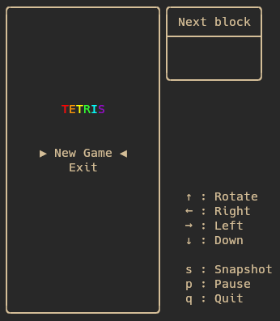

# Tetris


Une implémentation basique du jeu Tetris en C, jouable dans un terminal.

## Informations

Ce projet a été développé seul en 2025, dans le but de m'améliorer en langage C. J'ai séparé la logique de l'application dans une "API", et j'ai ajouté une interface visuelle à l'aide de la bibliothèque `ncurses`.

## Présentation

Le jeu fonctionne dans un terminal Linux. La compatibilité avec Windows n’a pas encore été testée. Cette version initiale permet de jouer, mais certaines fonctionnalités comme le score sont encore absentes.

Voici un aperçu de l'application.

<p align=center>
  
  
</p>

## Fonctionnalités

- Affichage des blocs avec `ncurses`
- Chute automatique des pièces
- Rotation des blocs
- Alignement de lignes et suppression
- Système de log pour le débogage

## Commandes clavier

- `←` et `→` : déplacer la pièce à gauche/droite
- `↓` : accélérer la descente
- `↑` : faire pivoter la pièce
- `p` : met le jeu en pause
- `q` : quitter le jeu
- `-` et `+` : accélére/décélére le jeu (pas implémenté)

## Installation

Sous Linux :

```bash
git clone https://github.com/IAidenI/Tetris
cd Tetris
make
./Tetris
```

## Architecture

Le projet est organisé en deux grandes parties :
- **API** – Logique métier du jeu ([voir ici](https://github.com/IAidenI/LinuxTools/tree/main/Permissions))
- **IHM** – Affichage dans le terminal via `ncurses` ([voir ici](https://github.com/IAidenI/LinuxTools/tree/main/Permissions))

Il contient également des fichiers secondaires pour :
- la gestion des blocs
- la couleur
- les options de debug
- et autres...

## Débogage

Un fichier de log est disponible ici : `/tmp/debug_tetris.log`  
Il contient des informations utiles pour diagnostiquer l'état de l'application.

Il est également possible de crée un snapshot via un fichier. En utilisant l'option -d <fichier> il est possible de mettre le jeu à un état précis. Le fichier doit avoir le même format que celui indiqué dans `example_snapshot.txt`. L'ordre n'importe pas et les espaces non plus.


## A faire

Ajout utilisateur
- [ ] Ajout du score
- [ ] Système de niveaux
- [ ] Ajout d'un menu de pause
- [ ] Ajout d'un aperce d'où sera la pièce
- [X] Ajout du 7-bag randomizer
- [ ] Spawn d'un bloc pas fluide avec les flèches
- [ ] Quitter ingame, demande de confirmation + revenir au menu

Ajout technique
- [X] Ajout d'un outil de debug pour mettre le jeu à un état précis
- [ ] Fix le segfault quand on spam la rotation
- [ ] Refactoring pour améliorer certaines parties du code
- [ ] Vérifier la compatibilité windows
- [ ] Refaire les debug pour en avoir des génériques
- [ ] Tri dans les .h
- [ ] Mieux commenter
- [ ] Timing chelou si on presse sur un bouton pile au moment ou la pièce se pose(c.f. discord)

Facultatif
- [ ] Crée un snapshot en pressant sur une touche
- [ ] Option pour utiliser le fichier de debug