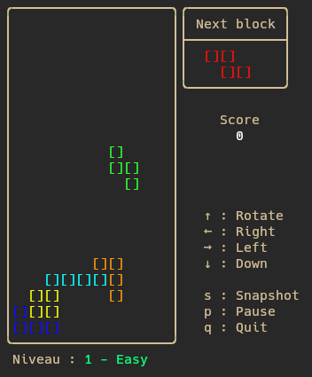
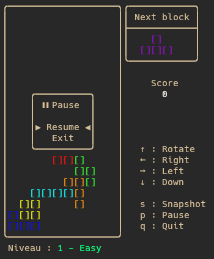

# Tetris


Une implémentation basique du jeu Tetris en C, jouable dans un terminal.

## Informations

Ce projet a été développé seul en 2025, dans le but de m'améliorer en langage C. J'ai séparé la logique de l'application dans une "API", et j'ai ajouté une interface visuelle à l'aide de la bibliothèque `ncurses`.

## Présentation

Le jeu fonctionne dans un terminal Linux. Il est actuellement incompatible avec windows. Cette version permet de jouer de manière fluide d'un point de vue utilisateur, mais il y a un gros travail à faire côté code.

Voici un aperçu de l'application.

<p align=center>
  
  
  
</p>

## Fonctionnalités

- Affichage des blocs avec `ncurses`
- Chute automatique des pièces
- Rotation des blocs
- Alignement de lignes et suppression
- Système de log pour le débogage

## Commandes clavier

- `←` et `→` : déplacer la pièce à gauche/droite
- `↓` : accélérer la descente
- `↑` : faire pivoter la pièce
- `p` : met le jeu en pause
- `q` : quitter le jeu
- `s` : crée un snapshot du jeu en cours (pas implémenté)

## Installation

Sous Linux :

```bash
git clone https://github.com/IAidenI/Tetris
cd Tetris
make
./Tetris
```

## Architecture

Le projet est organisé en trois grandes parties :
- **API** – Logique métier du jeu ([voir ici](https://github.com/IAidenI/Tetris/tree/main/sources/game.c))
- **IHM** – Affichage dans le terminal via `ncurses` ([voir ici](https://github.com/IAidenI/Tetris/tree/main/sources/ihm.c))
- **MENU** – Affichage des menus ([voir ici](https://github.com/IAidenI/Tetris/tree/main/sources/menu.c))

Il contient également des fichiers secondaires pour :
- la gestion des blocs
- la couleur
- les options de debug
- et autres...

## Débogage

Un fichier de log est disponible ici : `/tmp/debug_tetris.log`  
Il contient des informations utiles pour diagnostiquer l'état de l'application.

Il est également possible de crée un snapshot durant une partie via `s`. Ensuite il est possible de le charger utilisant l'option -d <fichier> pour mettre le jeu à un état précis.

Il est possible de crée son propre snapshot mais il doit avoir le même format que celui indiqué dans `example_snapshot.txt`. L'ordre n'importe pas et les espaces non plus.


## A faire

Ajout utilisateur
- [X] Ajout du score
- [X] Système de niveaux
- [X] Ajout d'un menu de pause
- [ ] Ajout d'un aperçue d'où sera la pièce
- [X] Ajout du 7-bag randomizer
- [ ] Ajout du hold
- [ ] Ajout meilleur score
- [ ] Spawn d'un bloc pas fluide avec les flèches
- [X] Quitter ingame, demande de confirmation + revenir au menu

Ajout technique
- [X] Ajout d'un outil de debug pour mettre le jeu à un état précis
- [ ] Fix le segfault quand on spam la rotation
- [ ] Refactoring pour améliorer certaines parties du code
- [X] Vérifier la compatibilité windows
- [ ] Refaire les debug pour en avoir des génériques
- [X] Tri dans les .h
- [ ] Mieux commenter
- [ ] Faire les else de can_change_color()

Facultatif
- [ ] Crée un snapshot en pressant sur une touche
- [X] Option pour utiliser le fichier de debug
- [ ] Faire une version windows